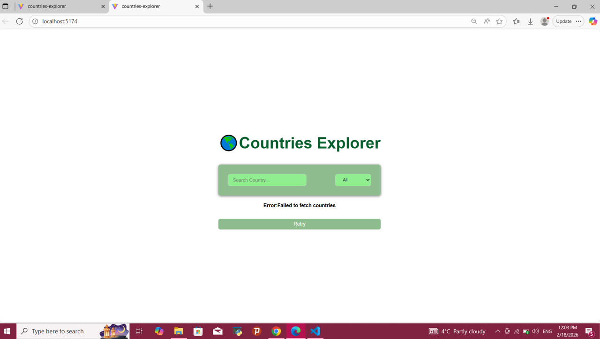
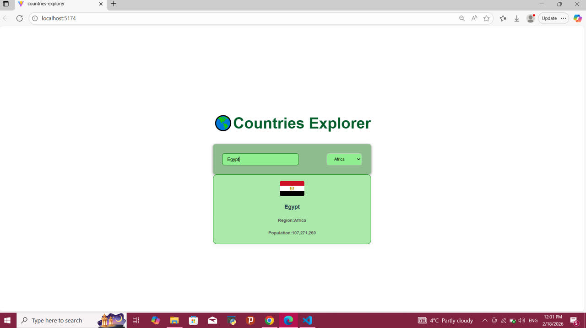

# countries-explorer

A React application that allows users to explore countries using the REST Countries API.

## Features

- Load all countries on page load
- Search countries by name
- Filter countries by region
- Loading indicator
- Error handling with retry button
- Responsive design

  
##  API Endpoints Used
This project uses the REST Countries API.
- Get all countries:
https://restcountries.com/v3.1/all

- Search country by name:
https://restcountries.com/v3.1/name/{name}

- Filter countries by region:
https://restcountries.com/v3.1/region/{region}

## How to run
1. Clone the repository     >>> https://github.com/Amenah195/countries-explorer
2. Go to the project folder >>> cd countries-explorer
3. Install dependencies     >>> npm install
4. Start the project        >>> open at  http://localhost:5174/

## Screenshots

## Built With
-React
-Css
-Rest Countries API

### Author
Amenah Askari

